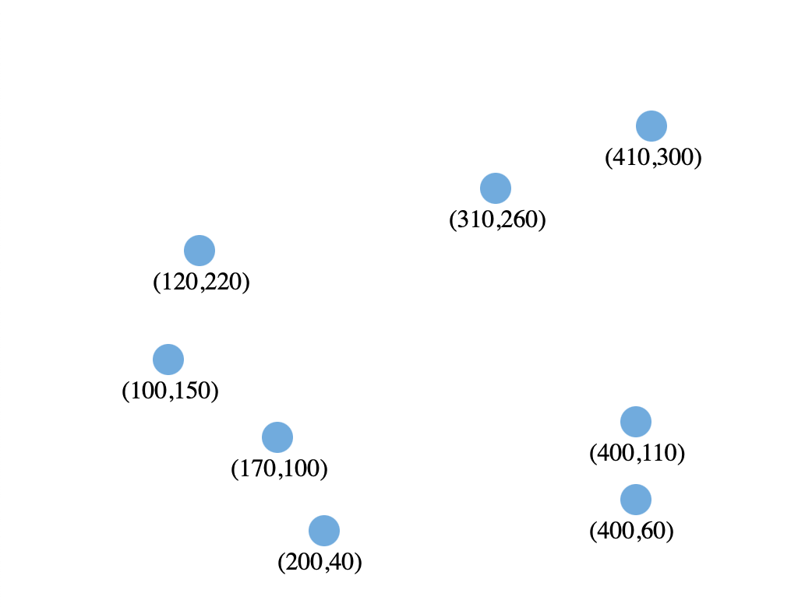
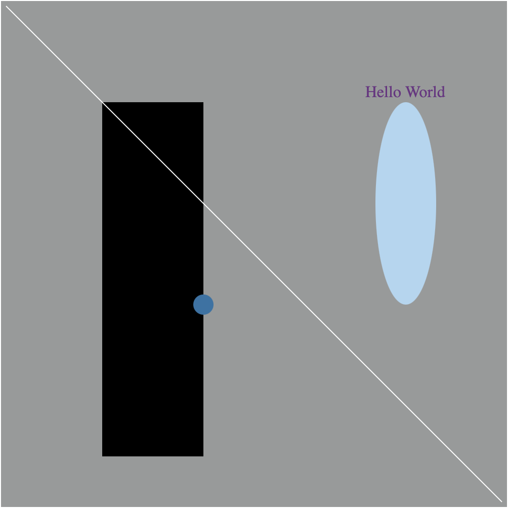

D3 - Foundations
================

D3 Foundations Chart
---------------------

The attached visualization is a scatter plot with a test dataset. The data is self-sourced, as this is a personal quantitative test to try out the foundations of D3. 

1. Here is an image of how the scatterplot displays:

Further is an visualization of a test with shape elements.

1. Here is am inmage of how the image diaplays:

