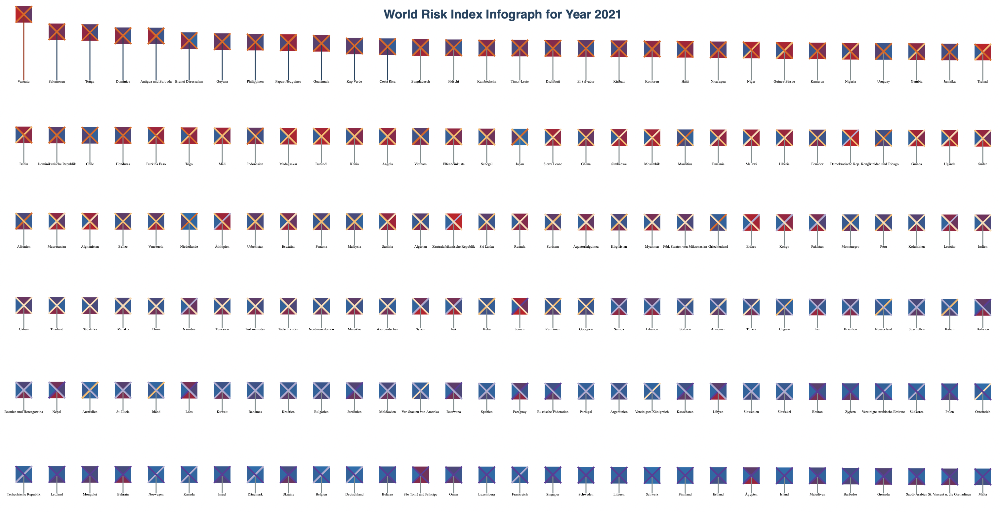
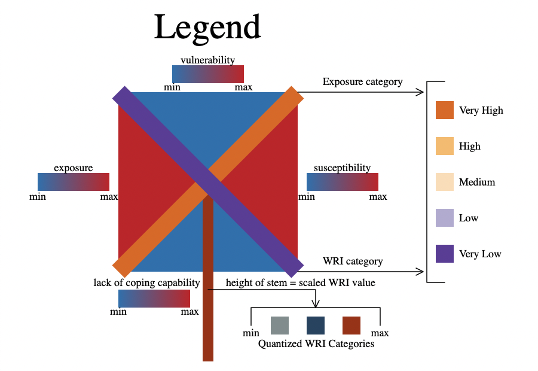

# Drawing Data Pt 2: Color & Accessibility

**Contents**
- About
- Dataset
- Scripts
- Accessibility & Color Changes
- Outputs
  1. Drawing 1
  2. Drawing 2
  
**About** 
This directory contains a script for creating a color accessible data inforgraph for the world disaster risk dataset (from kaggle) and a script for creating a legend for the data infograph.

**Datasets** 
I used the [World Disaster Risk Dataset](https://www.kaggle.com/datasets/tr1gg3rtrash/global-disaster-risk-index-time-series-dataset) dataset which I found on Kaggle. It is a open source and relatively simple and clean dataset, which can be directly used without any data cleaning.

I have also uploaded the same dataset in this directory and you can find it in the [data/World Risk Index](https://github.com/gauravpatil123/Interactive-Visualizations/blob/main/Drawing%20Data/data/World%20Risk%20Index/world_risk_index.csv) directory.

**Scripts** 
- Color_World_Risk_Index_Inforgraph.html 
Running this script on a server will create the visual infograph which is based
on the dataset mentioned above. I have used several metrics from the dataset
including exposure, vulnerability, suceptibility, wri score, lack of coping
capability, exposure category and wri category to reflect on the infograph. The
legend on how to read the infograph is seperately posted below.

- Legend.html 
Running this script on a server will create the legend to read the infograph
mentioned above. (You might need to zoom in your browser to see the enlarged legend - the absolute dimentions of the legend are small).

**Accessibility & Color Changes** 
  1. Made a uniform gradient scale for metrics [exposure, vunerability, suceptibility, lack of coping capability] instead of seperate one for each metric.
  2. Changed the gradient scale from monochromatic to dichromatic.
  3. Made the gradient color scale - colorblind safe. - (using COLORBREWER 2.0 & Adobe Color)
  4. Updated the category scale of metrics [Exposure category & WRI category] from *rainbow* to a colorblind safe scale.
    
  5. Updated the Quantized WRI category scale to have more neutral colors which are colorblind safe.
    
  6. Used seperate color scales for the categorized metrics (Exposure category & WRI category) & liniearly scaled metrics (exposure, vulnerability, suceptibility, lack of coping capability) to avoid color conflicts and to make these scales colorblind safe.

**Outputs** 
- Drawing 1 | World Disaster Risk Dataset Infograph

- Drawing 2 | Infograph Legend

