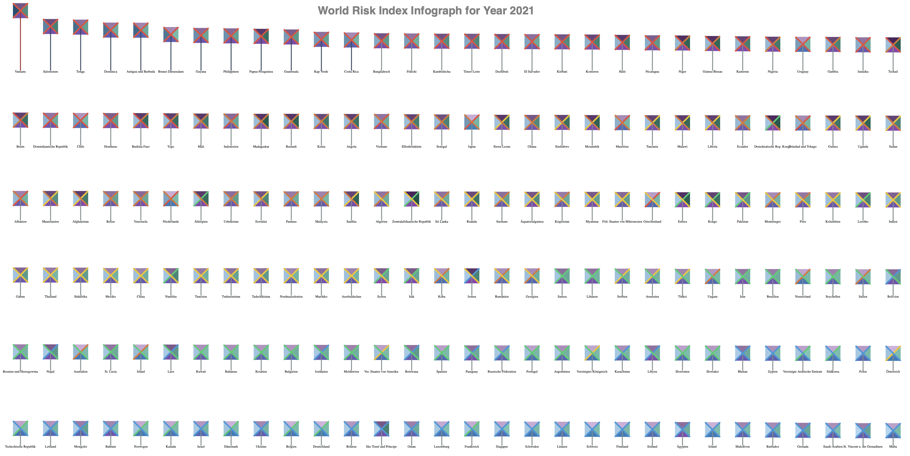
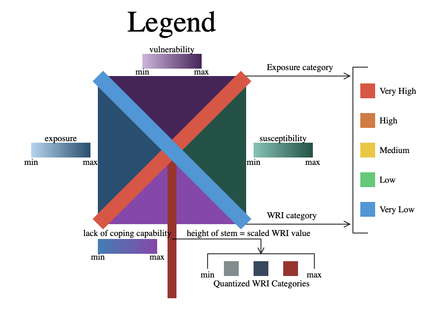

# Drawing Data

**Contents**
- About
- Dataset
- Scripts
- Outputs
  1. Drawing 1
  2. Drawing 2
  3. Drawing 3
  
**About** 
This directory contains script for drawing fundamental shapes using svg path, a script for creating a data inforgraph for the world disaster risk dataset (from kaggle) and a script for creating a legend for the data infograph.

**Datasets** 
I used the [World Disaster Risk Dataset](https://www.kaggle.com/datasets/tr1gg3rtrash/global-disaster-risk-index-time-series-dataset) dataset which I found on Kaggle. It is a open source and relatively simple and clean dataset, which can be directly used without any data cleaning.

I have also uploaded the same dataset in this directory and you can find it in the [data/World Risk Index](https://github.com/gauravpatil123/Interactive-Visualizations/blob/main/Drawing%20Data/data/World%20Risk%20Index/world_risk_index.csv) directory.

**Scripts** 
- World_Risk_Index_Inforgraph.html 
Running this script on a server will create the visual infograph which is based on the dataset mentioned above. I have used several datapoints from the dataset including exposure, vulnerability, suceptibility, wri score, lack of coping capability, exposure category and wri category to reflect on the infograph. The legend on hoe to read the infograph is seperately posted below.

- Legend.html 
Running this script on a server wil create the legend to read the infograph mentioed above. (You might need to zoom in your browser to see the enlarged legend - the absolute dimentions of the legend are small).

- Drawing_SVG_Path.html 
Running this script will draw the shapes of playstation comtroller buttons - this was just to practice drawing using svg path.

**Outputs** 
- Drawing 1 | World Disaster Risk Dataset Infograph

- Drawing 2 | Infograph Legend

- Drawing 3 | Playstation Controller Buttons

