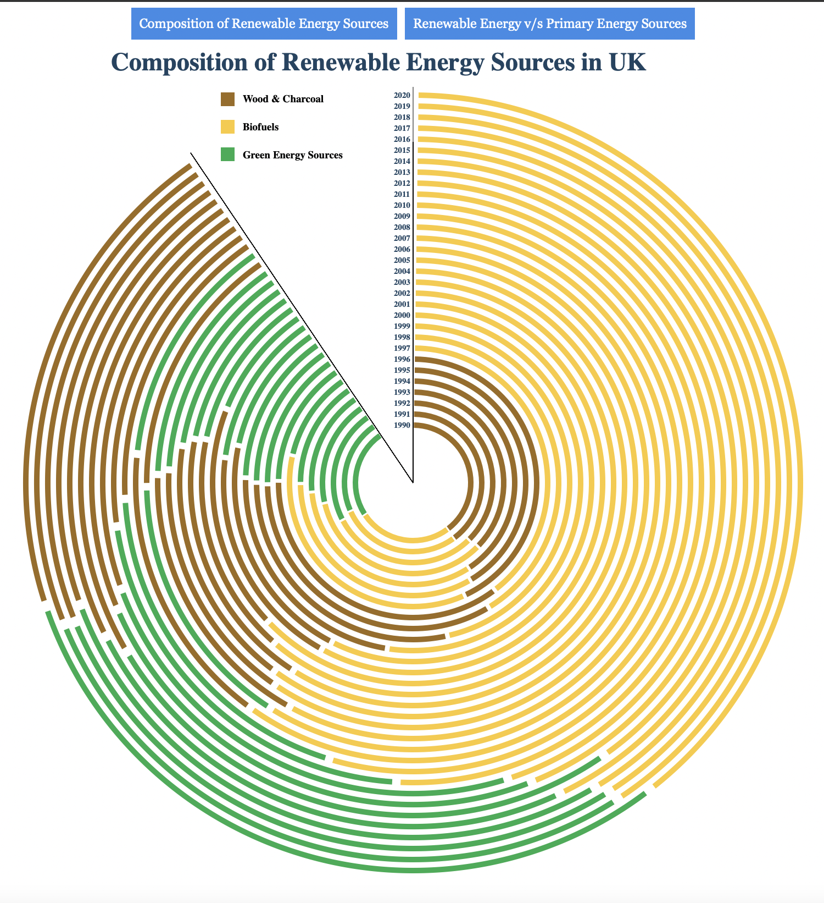

# Layouts

**Contents**
- About
- Dataset
- Scripts
- Interactivity Features
- Outputs
  1. Infograph #1 | Renewable Energy Sources V/S Primary Energy Sources in UK
  2. Infograph #2 | Composition of Renewable Energy Sources in UK

**About** 
This directory contains a scripts for creating infographs for the Energy consumption sources in UK through years.

**Datasets** 
I used the [UK Renewable Energy Consumption Dataset](https://www.kaggle.com/datasets/magnussesodia/uk-renewable-energy-production) dataset which I found on Kaggle. It is a open source and relatively simple and clean dataset, which can be directly used without any data cleaning.

I have also uploaded the same dataset in this directory and you can find it in the [data/UK Renewable Energy Consumption Dataset]() directory.

**Scripts** 
- UK_Renewable_Energy_Consumption_Interactive.html 
Running this script on a server will create a interactive infograph of renewable energy sources v/s primary energy sources in UK from 1990 to 2020. The infograph will have two buttons on the top. Clicking the first one creates a new infograph that has composition of renewable energy sources in UK from 1990 to 2020. Clicking the second button will create the first infograph again.

- UK_Renewable_Energy_Consumption.html 
Running this script will create the same two infographs as the previous script on the same page but without the interactivity.

**Interactivity Features** 
  1. Button #1 | Composition of Renewable Energy Sources: Clicking this button will create an infograph for the composition of renewable sources of energy in UK from 1990 to 2020
  2. Button #2 | Renewable Energy V/S Primary Energy Sources: Clicking this button will create an infograph for the renewable energy sources v/s primary energy sources in UK from 1990 to 2020

**Outputs** 
- Infograph #1 | Renewable Energy Sources V/S Primary Energy Sources in UK 

- Infograph #2 | Composition of Renewable Energy Sources in UK 
