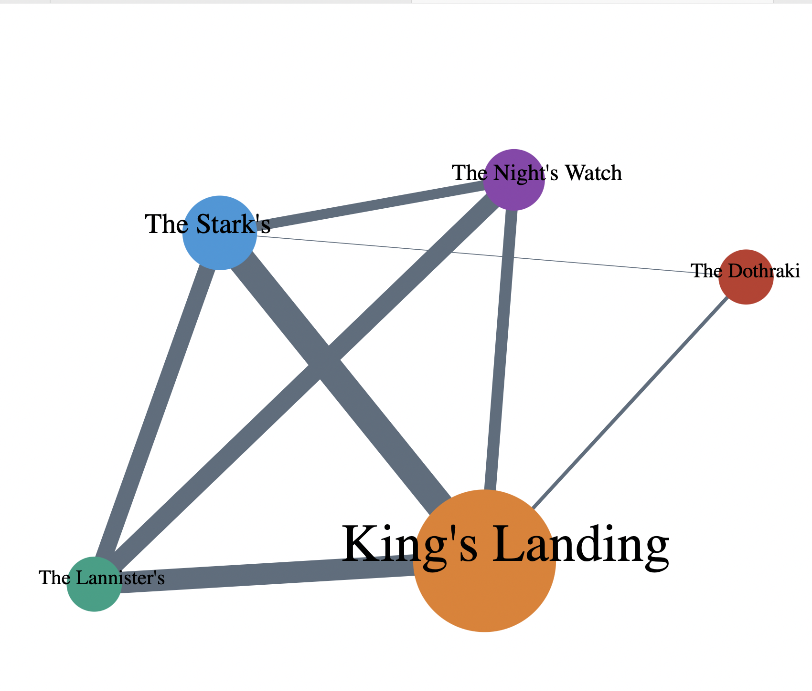

# Layouts

**Contents**
- About
- Dataset
- Script
- Outputs
  1. Network #1 | Game of Thrones Series Season #1 Hypergraph

**About** 
This directory contains a script for creating a hypergraph of Game of Thrones Season #1 The series.

**Datasets** 
I have created the hypergraph [dataset](https://github.com/gauravpatil123/Interactive-Visualizations/tree/main/Networks%20%26%20Hierarchies/data/got-series-s1-constructed) myself from the dataset published by network of thrones.

The original dataset used to create the hypergraph dataset can be found [here](https://github.com/mathbeveridge/gameofthrones).

**Scripts** 
- got-series-s1-network.html 
Running this script on a server will create a hypergraph of all the nodes and edges from the game of thrones season one network dataset. The network graph is interactive with user being able to drag the nodes.

**Outputs** 
- Network #1 | Game of Thrones Series Season #1 Hypergraph 

